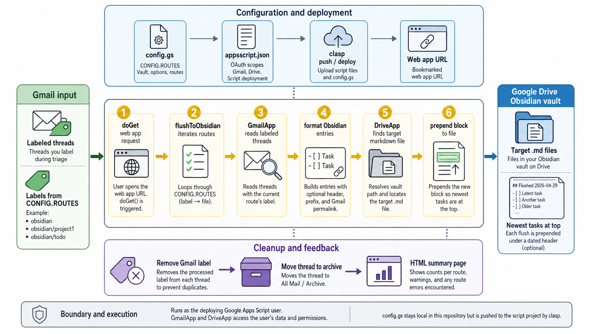

<div align="center">
  

  **📬 Flush labeled Gmail threads into [Obsidian](https://obsidian.md/) task files with one click ✅**
</div>

gmail2obsidian is a Google Apps Script that turns Gmail labels into Obsidian tasks stored in markdown files on Google Drive. Label emails while triaging your inbox, click the deployed web app URL, and each matching thread is prepended to the configured vault file with a Gmail permalink.

The script is deployed with `clasp`, runs as your Google Apps Script user, and removes each processed label after a successful write so the same thread is not flushed twice.

## Setup

Create a Google Apps Script project at [script.google.com](https://script.google.com), copy its Script ID from Project Settings, then run:

```bash
git clone git@github.com:tsilva/gmail2obsidian.git
cd gmail2obsidian
npm install -g @google/clasp
make setup
make login
```

Enable the Apps Script API at [script.google.com/home/usersettings](https://script.google.com/home/usersettings), then edit `.clasp.json` and replace `YOUR_SCRIPT_ID_HERE` with your Script ID.

Edit `config.gs` with your vault path and routes, then deploy:

```bash
make deploy
```

Bookmark the printed web app URL. To use it, apply one of your configured Gmail labels to threads and open the bookmark.

## Configuration

`make setup` copies `config.example.gs` to `config.gs`. `config.gs` is ignored by git but included in `clasp` uploads.

```javascript
const CONFIG = {
  VAULT_FOLDER: "Obsidian/YourVault",
  MAX_THREADS: 50,
  ENTRY_PREFIX: "checkbox",
  ENTRY_LINK: true,
  ENTRY_HEADER: true,
  ROUTES: [
    { label: "obsidian", file: "inbox.md" },
    { label: "obsidian/project1", file: "project1/inbox.md" },
  ],
};
```

Use `VAULT_FOLDER_ID` instead of `VAULT_FOLDER` when the vault is in a shared or cross-account Drive folder. Set `GMAIL_ACCOUNT_INDEX` when Gmail permalinks should open a non-default Google account, such as `/u/1`.

## Output

By default, each email becomes a checkbox under a dated flush header:

```markdown
## Flushed 2026-04-29
- [ ] [Meeting notes from Tuesday](https://mail.google.com/mail/u/0/#all/abc123)
- [ ] [Project proposal review](https://mail.google.com/mail/u/0/#all/def456)
```

`ENTRY_PREFIX` can be `"checkbox"`, `"bullet"`, or `"none"`. `ENTRY_LINK` controls whether subjects become Gmail links, and `ENTRY_HEADER` controls the dated header.

## Commands

```bash
make setup   # install git hooks, create .clasp.json, and copy config.gs
make login   # authenticate clasp with Google
make push    # upload gmail2obsidian.gs, config.gs, and appsscript.json
make deploy  # push and update the stable web app deployment URL
make open    # open the Apps Script project
```

## Notes

- Target `.md` files must already exist in the Drive vault.
- Gmail labels must match `CONFIG.ROUTES` exactly; nested labels use `/`.
- `MAX_THREADS` caps each label batch to avoid Apps Script timeouts. Run the web app again if the summary reports that the cap was reached.
- Routes fail independently. Missing labels are skipped; target file errors are reported in the HTML summary without stopping other routes.
- `make deploy` reuses the existing active deployment so bookmarked `/exec` URLs do not go stale.
- `appsscript.json` declares Gmail modify, Drive, and Apps Script deployment scopes.
- `.claspignore` uploads only `gmail2obsidian.gs`, `config.gs`, and `appsscript.json`.

## Architecture



## License

[MIT](LICENSE)
